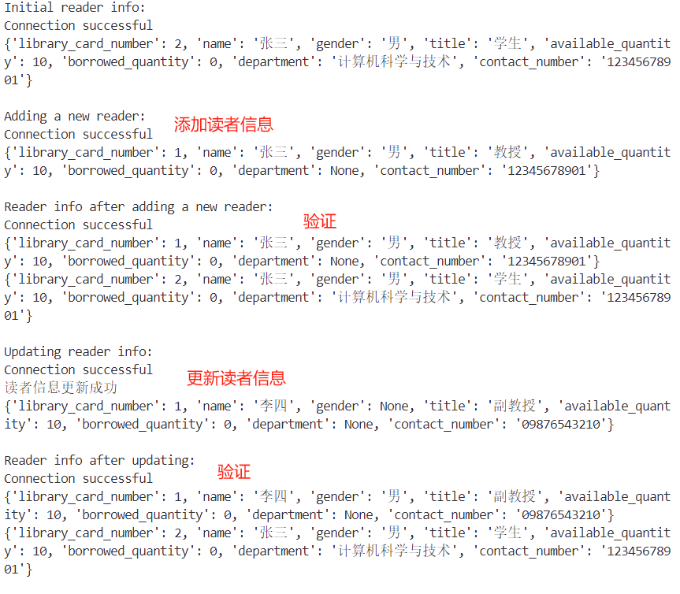
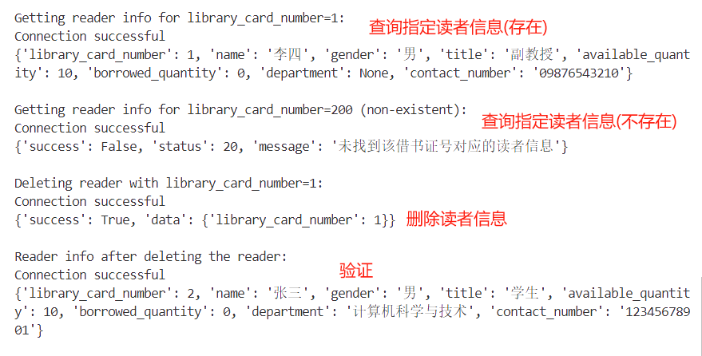
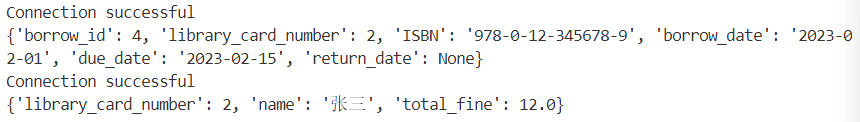

# Database 图书馆

安装库(新添了datetime库计算日期)

```bash
pip install -r requirements.txt
```

用pyodbc的库进行数据库与python连接，[pyodbc wiki](https://github.com/mkleehammer/pyodbc/wiki)  
注意:

(1)要将login.py中server改成自己的server  

```python
server = 'your_server' # 输入要连接的服务器名称
```

(2)要在api建立连接后要设置cnxn.autocommit=False,类似于下面代码

```python
try:
    cnxn.autocommit = False
    params = [ ('A', 1), ('B', 2) ]
    cursor.executemany("insert into t(name, id) values (?, ?)", params)
except pyodbc.DatabaseError as err:
    cnxn.rollback()
else:
    cnxn.commit()
finally:
    cnxn.autocommit = True
```

返回出错和正确统一用returnValue.py中的success和error函数，在文件前面import进去就好。


# admin板块

* **add_reader函数**

  **功能：** 添加读者信息

  **参数：** library_card_number, name=None, gender=None, title=None, available_quantity=10, borrowed_quantity=0, department=None, contact_number=None

  调用此函数时library_card_number一定要给出，其余可以省略。

  其中available_quantity(可借数量)默认为10，borrowed_quantity(已借书数量)默认为0、

  **返回值：**

  * 成功

    ```python
    return success({
        "library_card_number": library_card_number,
        "name": name,
        "gender": gender,
        "title": title,
        "available_quantity": available_quantity,
        "borrowed_quantity": borrowed_quantity, 
        "department": department, 
        "contact_number": contact_number
    })
    ```

  * 失败

    ```python
    except pyodbc.DatabaseError as e:
    	...
        return error(301, '添加读者失败: ' + str(e))
    except Exception as e:
        return error(401, "错误: " + str(e))
    ```
  
* delete_reader函数

  功能：删除指定读者信息

  参数：library_card_number

  返回值：

  * 成功

    ```python
    return success({
        "library_card_number":library_card_number
    })
    ```

  * 失败

    ```python
    except pyodbc.DatabaseError as e:
        ...
        return error(301,'删除读者信息失败:' + str(e))
    except Exception as e:
        return error(401,"错误"+str(e)) 
    ```

* print_all_reader_info函数

  **功能**：打印整个reader_info表格

  **参数**：无

  **返回值**：

  * 成功

    ```python
    return success({"readers": all_reader_info})
    ```

    其中all_reader_info是一个字典类型，内容为reader_info表格

  * 失败

    ```python
    except pyodbc.DatabaseError as e:
    	...
        return error(301,'删除读者信息失败:' + str(e))
    except Exception as e:
        return error(401,"错误"+str(e)) 
    ```

* get_reader_info函数

  **功能**：打印指定读者的信息

  **参数**：library_card_number

  **返回值**：

  * 成功

    ```python
    return success(reader_info)
    ```

    其中reader_info为一个字典类型，内容为借书证号为library_card_number的读者信息

  * 失败

    ```python
    	return error(20, "未找到该借书证号对应的读者信息")
    except pyodbc.DatabaseError as e:
        ...
        return error(301,'删除读者信息失败:' + str(e))
    except Exception as e:
        return error(401,"错误"+str(e)) 
    ```

* get_overdue_books函数

  **功能**：查询所有到期未归还的图书信息

  **参数**：无

  **返回值**：

  * 成功

    ```python
    return success({"overdue_books": overdue_books_info})
    ```

    其中overdue_books_info是一个字典类型，内容为所有到期未归还的图书信息

  * 失败

    ```python
    except pyodbc.DatabaseError as e:
    	...
        return error(301,'删除读者信息失败:' + str(e))
    except Exception as e:
        return error(401,"错误"+str(e)) 
    ```

* get_reader_fines函数

  **功能**：查询所有读者的欠款状况

  **参数**：无

  **返回值**：

  * 成功

    ```python
    return success({"readers_fines": reader_fines_info})
    ```

    其中reader_fines_info是一个字典类型，内容为读者欠费状况

  * 失败

    ```python
    except pyodbc.DatabaseError as e:
    	...
        return error(301,'删除读者信息失败:' + str(e))
    except Exception as e:
        return error(401,"错误"+str(e)) 
    ```

    

# test_admin函数

* 运行test_admin_reader()的参考结果

  

* 运行test_admin_book_borrow()参考结果

  首先插入几条示例借阅信息(已更新在github仓库中的sql文件中)

```sql
-- 插入借阅信息
INSERT INTO borrow_info (library_card_number, ISBN, borrow_date, due_date, return_date, fine)
VALUES 
(2, '978-3-16-148410-0', '2023-01-01', '2023-01-15', '2023-01-14', 0.00),--过期已还
(2, '978-0-12-345678-9', '2023-02-01', '2023-02-15', NULL, 12.00),--过期未还
(2, '978-1-23-456789-0', '2023-01-01', '2025-01-15', NULL, 0.00) --未过期且未还
```



只有过期未还的借阅信息需要被打印出来，结果相符。
