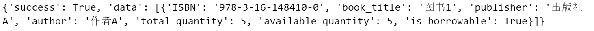
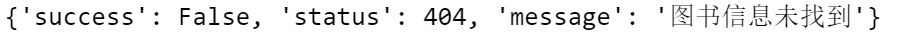
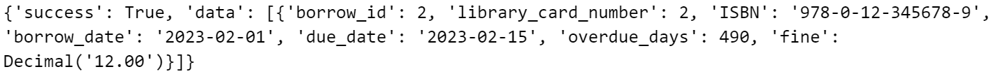
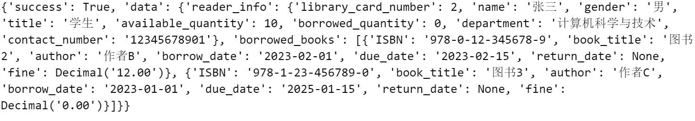
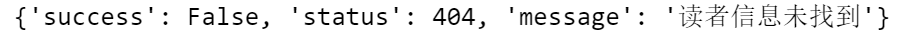

# Database 图书馆

安装库(新添了datetime库计算日期)

```bash
pip install -r requirements.txt
```

用pyodbc的库进行数据库与python连接，[pyodbc wiki](https://github.com/mkleehammer/pyodbc/wiki)  
注意:

(1)要将login.py中server改成自己的server  

```python
server = 'your_server' # 输入要连接的服务器名称
```

(2)要在api建立连接后要设置cnxn.autocommit=False,类似于下面代码

```python
try:
    cnxn.autocommit = False
    params = [ ('A', 1), ('B', 2) ]
    cursor.executemany("insert into t(name, id) values (?, ?)", params)
except pyodbc.DatabaseError as err:
    cnxn.rollback()
else:
    cnxn.commit()
finally:
    cnxn.autocommit = True
```

返回出错和正确统一用returnValue.py中的success和error函数，在文件前面import进去就好。


# admin板块

* **add_reader函数**

  **功能：** 添加读者信息

  **参数：** library_card_number, name=None, gender=None, title=None, available_quantity=10, borrowed_quantity=0, department=None, contact_number=None

  调用此函数时library_card_number一定要给出，其余可以省略。

  其中available_quantity(可借数量)默认为10，borrowed_quantity(已借书数量)默认为0、

  **返回值：**

  * 成功

    ```python
    {
        "success":True,
        "data":{
                "library_card_number": library_card_number,
                "name": name,
                "gender": gender,
                "title": title,
                "available_quantity": available_quantity,
                "borrowed_quantity": borrowed_quantity, 
                "department": department, 
                "contact_number": contact_number
                }
    }
    
    ```
  
  * 失败
  
    ```python
    except pyodbc.DatabaseError as e:
    	...
        return error(301, '添加读者失败: ' + str(e))
    except Exception as e:
        return error(401, "错误: " + str(e))
    ```
  
* delete_reader函数

  功能：删除指定读者信息

  参数：library_card_number

  返回值：

  * 成功

    ```python
    {
        "success":True,
        "data":{"library_card_number":library_card_number}
    }
    ```

  * 失败

    ```python
    except pyodbc.DatabaseError as e:
        ...
        return error(301,'删除读者信息失败:' + str(e))
    except Exception as e:
        return error(401,"错误"+str(e)) 
    ```

* print_all_reader_info函数

  **功能**：打印整个reader_info表格

  **参数**：无

  **返回值**：

  * 成功

    ```python
    {
        "success":True,
        "data":{"readers":[数组元素]}
    }
    # 数组元素
    {
    "library_card_number": library_card_number,
    "name": name,
    "gender": gender,
    "title": title,
    "available_quantity": available_quantity,
    "borrowed_quantity": borrowed_quantity, 
    "department": department, 
    "contact_number": contact_number
    }
    ```

    其中all_reader_info是一个字典类型，内容为reader_info表格

  * 失败

    ```python
    except pyodbc.DatabaseError as e:
    	...
        return error(301,'删除读者信息失败:' + str(e))
    except Exception as e:
        return error(401,"错误"+str(e)) 
    ```

* get_reader_info函数

  **功能**：打印指定读者的信息

  **参数**：library_card_number

  **返回值**：

  * 成功

    ```python
    {
        "success":True,
        "data":{
                "library_card_number": library_card_number,
                "name": name,
                "gender": gender,
                "title": title,
                "available_quantity": available_quantity,
                "borrowed_quantity": borrowed_quantity, 
                "department": department, 
                "contact_number": contact_number
                }
    }
    ```

    其中reader_info为一个字典类型，内容为借书证号为library_card_number的读者信息

  * 失败

    ```python
    	return error(20, "未找到该借书证号对应的读者信息")
    except pyodbc.DatabaseError as e:
        ...
        return error(301,'删除读者信息失败:' + str(e))
    except Exception as e:
        return error(401,"错误"+str(e)) 
    ```

* get_overdue_books函数

  **功能**：查询所有到期未归还的图书信息

  **参数**：无

  **返回值**：

  * 成功

    ```python
    {
        "success":True,
        "data":{"overdue_books":[数组元素]}
    }
    # 数组元素
    {
    "borrow_id": borrow_id,
    "library_card_number": library_card_number,
    "ISBN": ISBN,
    "borrow_date": borrow_date,
    "due_date": due_date,
    "return_date":return_date
    }
    ```

    其中overdue_books_info是一个字典类型，内容为所有到期未归还的图书信息

  * 失败

    ```python
    except pyodbc.DatabaseError as e:
    	...
        return error(301,'删除读者信息失败:' + str(e))
    except Exception as e:
        return error(401,"错误"+str(e)) 
    ```

* get_reader_fines函数

  **功能**：查询所有读者的欠款状况

  **参数**：无

  **返回值**：

  * 成功

    ```python
    {
        "success":True,
        "data":{"readers_fines":[数组元素]}
    }
    # 数组元素
    {
    "library_card_number": library_card_number,
    "name": name,
    "total_fine": float(total_fine) if total_fine is not None else 0.0
    }
    ```
  
    其中reader_fines_info是一个字典类型，内容为读者欠费状况
  
  * 失败
  
    ```python
    except pyodbc.DatabaseError as e:
    	...
        return error(301,'删除读者信息失败:' + str(e))
    except Exception as e:
        return error(401,"错误"+str(e)) 
    ```
  
    

# test_admin函数

* 运行test_admin_reader()的参考结果

  

* 运行test_admin_book_borrow()参考结果

  首先插入几条示例借阅信息(已更新在github仓库中的sql文件中)

```sql
-- 插入借阅信息
INSERT INTO borrow_info (library_card_number, ISBN, borrow_date, due_date, return_date, fine)
VALUES 
(2, '978-3-16-148410-0', '2023-01-01', '2023-01-15', '2023-01-14', 0.00),--过期已还
(2, '978-0-12-345678-9', '2023-02-01', '2023-02-15', NULL, 12.00),--过期未还
(2, '978-1-23-456789-0', '2023-01-01', '2025-01-15', NULL, 0.00) --未过期且未还
```


只有过期未还的借阅信息需要被打印出来，结果相符。

# book_search 板块

- **search_books 函数**

  **功能：** 搜索图书，搜索关键词可以是书籍的ISBN号、作者、出版社和书名

  **参数：** 输入字符串，可以是 ISBN，author，publisher 或者 book_title

  **返回值：**

  - 成功

    ```sql
    for book in overdue_books:
    	overdue_books_data.append({
        	"borrow_id": book.borrow_id,
            "library_card_number": book.library_card_number,
            "ISBN": book.ISBN,
            "borrow_date": book.borrow_date,
            "due_date": book.due_date,
            "overdue_days": book.overdue_days,
            "fine": book.fine
         })
    return success(books)
    ```

  - 失败

    ```sql
    if not results:
        return error(404, "图书信息未找到")
    
    except pyodbc.DatabaseError as e:
    	...
        return error(301, '查询失败: ' + str(e))
    except Exception as e:
        return error(401, "错误: " + str(e))
    ```

  

  **运行测试**：

  查找成功：

  

  没有图书记录：

  

  # overdue_books 板块

  - **get_overdue_books 函数**

    **功能**：查询未归还图书信息

    **参数**： library_card_number, name=None, gender=None, title=None, available_quantity=10, borrowed_quantity=0, department=None, contact_number=None

    调用此函数时library_card_number一定要给出，其余可以省略。

    其中available_quantity(可借数量)默认为10，borrowed_quantity(已借书数量)默认为0、

    **返回值**：

    - 成功

      ```sql
      for row in results:
      	books.append({
      		"ISBN": row.ISBN,
              "book_title": row.book_title,
              "publisher": row.publisher,
              "author": row.author,
               "total_quantity": row.total_quantity,
              "available_quantity": row.available_quantity,
              "is_borrowable": row.is_borrowable
      })
      return success(books)
      ```

    - 失败

      ```sql
      except pyodbc.DatabaseError as e:
      	...
          return error(301, '查询失败: ' + str(e))
      except Exception as e:
          return error(401, "错误: " + str(e))
      ```

    **运行测试**：

    查找成功：

    

    

  # reader_query 板块

  - **get_reader_info 函数**

    **功能：** 查询读者个人信息和读者借书信息

    **参数：** 输入 library_card_number

    **返回值**：

    - 成功

      ```sql
      reader_data = {
      	"library_card_number": reader_info.library_card_number,
      	"name": reader_info.name,	
      	"gender": reader_info.gender,
      	"title": reader_info.title,
      	"available_quantity": reader_info.available_quantity,
      	"borrowed_quantity": reader_info.borrowed_quantity,
      	"department": reader_info.department,
      	"contact_number": reader_info.contact_number
          }
      ...
      for book in borrowed_books:
      	borrowed_books_data.append({
      		"borrow_id":book.borrow_id,
              "ISBN": book.book_ISBN,
              "book_title": book.book_title,
              "author": book.author,
              "borrow_date": book.borrow_date,
              "due_date": book.due_date,
              "return_date": book.return_date,
              "fine": book.fine
           })
           
      return success({
      	"reader_info": reader_data,
      	"borrowed_books": borrowed_books_data,
      })
      ```

    - 失败

      ```sql
      if not reader_info:
      	return error(404, "读者信息未找到")
      	
      except pyodbc.DatabaseError as e:
              cursor.rollback()
              cursor.close()
              cnxn.close()
              return error(301, '查询失败: ' + str(e))
      except Exception as e:
              return error(401, "错误: " + str(e))
      ```

    **运行测试**：

    查询成功：

    

    没有该读者记录：

>>>>>>> 4c23c6a119f33babee68c1752146b7dc687848d7
